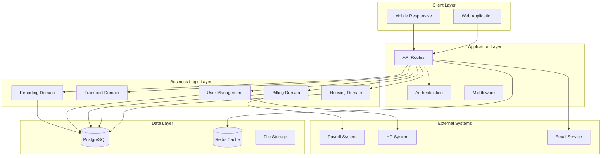

# Design Document

## Overview

The Housing and Transportation ERP system will be built as a modular, enterprise-grade web application using Next.js 14 with the App Router. The architecture follows domain-driven design principles with clear separation of concerns, ensuring maintainability and scalability for BOH Concepts' distributed hospitality operations.

The system adopts a modular monolith approach, organizing code by business domains while maintaining deployment simplicity. This design supports the transition from manual spreadsheet processes to a comprehensive digital platform with role-based access, real-time data processing, and seamless payroll integration.

## Architecture

### High-Level Architecture



### Domain-Driven Design Structure

The application is organized into distinct business domains, each with its own models, services, and API endpoints:

1. **Housing Domain**: Property management, room assignments, occupancy tracking
2. **Transport Domain**: Vehicle registry, trip logging, route management
3. **Billing Domain**: Cost calculation, payroll integration, invoice generation
4. **User Management Domain**: Authentication, authorization, role management
5. **Reporting Domain**: Analytics, dashboards, export functionality

### Technology Stack

- **Frontend**: Next.js 14 with App Router, React 18, TypeScript
- **Styling**: Tailwind CSS with shadcn/ui components
- **Backend**: Supabase (PostgreSQL database, Auth, Storage, Edge Functions)
- **Database**: Supabase PostgreSQL with auto-generated APIs
- **Authentication**: Supabase Auth with role-based access control
- **File Storage**: Supabase Storage for documents and assets
- **Real-time**: Supabase Realtime for live updates
- **Email**: Supabase Edge Functions with email providers
- **State Management**: Custom React hooks with SWR for data fetching

## Components and Interfaces

### Core Domain Models

#### Housing Domain Models

```typescript
interface Property {
  id: string
  name: string
  address: string
  totalCapacity: number
  status: PropertyStatus
  rooms: Room[]
  createdAt: Date
  updatedAt: Date
}

interface Room {
  id: string
  propertyId: string
  roomNumber: string
  capacity: number
  amenities: string[]
  status: RoomStatus
  assignments: RoomAssignment[]
}

interface RoomAssignment {
  id: string
  roomId: string
  staffId: string
  startDate: Date
  endDate?: Date
  status: AssignmentStatus
  moveInDate?: Date
  moveOutDate?: Date
}
```

#### Transport Domain Models

```typescript
interface Vehicle {
  id: string
  make: string
  model: string
  year: number
  capacity: number
  registration: string
  status: VehicleStatus
  trips: Trip[]
}

interface Trip {
  id: string
  vehicleId: string
  date: Date
  route: string
  passengerCount: number
  distance: number
  cost: number
  driverId: string
  passengers: TripPassenger[]
}
```

#### Billing Domain Models

```typescript
interface BillingPeriod {
  id: string
  startDate: Date
  endDate: Date
  status: BillingStatus
  charges: Charge[]
  payrollExportDate?: Date
}

interface Charge {
  id: string
  staffId: string
  billingPeriodId: string
  type: ChargeType
  amount: number
  description: string
  prorationFactor?: number
  sourceId: string // roomAssignmentId or tripId
}
```

### Service Layer Architecture

Each domain implements a consistent service pattern:

```typescript
interface DomainService<T, CreateDTO, UpdateDTO> {
  create(data: CreateDTO): Promise<T>
  findById(id: string): Promise<T | null>
  findMany(filters: FilterOptions): Promise<T[]>
  update(id: string, data: UpdateDTO): Promise<T>
  delete(id: string): Promise<void>
}
```

### API Layer Structure

API routes are organized by domain with consistent patterns:

```
/api/
├── housing/
│   ├── properties/
│   │   ├── route.ts (GET, POST)
│   │   └── [id]/
│   │       ├── route.ts (GET, PUT, DELETE)
│   │       └── rooms/route.ts
│   └── assignments/
│       ├── route.ts
│       └── [id]/route.ts
├── transport/
│   ├── vehicles/
│   └── trips/
├── billing/
│   ├── periods/
│   ├── charges/
│   └── export/
├── users/
└── reports/
```

### Frontend Component Architecture

The UI follows a hierarchical component structure with shared components and domain-specific modules:

```
components/
├── ui/ (shadcn/ui base components)
├── shared/
│   ├── Layout/
│   ├── Navigation/
│   ├── DataTable/
│   └── Forms/
├── housing/
│   ├── PropertyList/
│   ├── RoomAssignment/
│   └── OccupancyDashboard/
├── transport/
│   ├── VehicleRegistry/
│   ├── TripLogger/
│   └── RouteOptimizer/
├── billing/
│   ├── ChargeCalculator/
│   ├── BillingPeriod/
│   └── PayrollExport/
└── reporting/
    ├── Dashboard/
    ├── Analytics/
    └── ExportTools/
```

## Data Models

### Database Schema Design

The database schema follows normalized design principles with appropriate indexes for performance:

```sql
-- Properties and Rooms
CREATE TABLE properties (
  id UUID PRIMARY KEY DEFAULT gen_random_uuid(),
  name VARCHAR(255) NOT NULL,
  address TEXT NOT NULL,
  total_capacity INTEGER NOT NULL,
  status VARCHAR(50) NOT NULL DEFAULT 'active',
  created_at TIMESTAMP DEFAULT NOW(),
  updated_at TIMESTAMP DEFAULT NOW()
);

CREATE TABLE rooms (
  id UUID PRIMARY KEY DEFAULT gen_random_uuid(),
  property_id UUID REFERENCES properties(id),
  room_number VARCHAR(50) NOT NULL,
  capacity INTEGER NOT NULL,
  amenities JSONB DEFAULT '[]',
  status VARCHAR(50) NOT NULL DEFAULT 'available',
  created_at TIMESTAMP DEFAULT NOW(),
  updated_at TIMESTAMP DEFAULT NOW()
);

-- Staff and Assignments
CREATE TABLE staff (
  id UUID PRIMARY KEY DEFAULT gen_random_uuid(),
  employee_id VARCHAR(100) UNIQUE NOT NULL,
  first_name VARCHAR(100) NOT NULL,
  last_name VARCHAR(100) NOT NULL,
  email VARCHAR(255) UNIQUE NOT NULL,
  phone VARCHAR(50),
  employment_status VARCHAR(50) NOT NULL,
  housing_eligible BOOLEAN DEFAULT false,
  created_at TIMESTAMP DEFAULT NOW(),
  updated_at TIMESTAMP DEFAULT NOW()
);

CREATE TABLE room_assignments (
  id UUID PRIMARY KEY DEFAULT gen_random_uuid(),
  room_id UUID REFERENCES rooms(id),
  staff_id UUID REFERENCES staff(id),
  start_date DATE NOT NULL,
  end_date DATE,
  status VARCHAR(50) NOT NULL DEFAULT 'active',
  move_in_date DATE,
  move_out_date DATE,
  created_at TIMESTAMP DEFAULT NOW(),
  updated_at TIMESTAMP DEFAULT NOW()
);

-- Vehicles and Trips
CREATE TABLE vehicles (
  id UUID PRIMARY KEY DEFAULT gen_random_uuid(),
  make VARCHAR(100) NOT NULL,
  model VARCHAR(100) NOT NULL,
  year INTEGER NOT NULL,
  capacity INTEGER NOT NULL,
  registration VARCHAR(50) UNIQUE NOT NULL,
  status VARCHAR(50) NOT NULL DEFAULT 'active',
  created_at TIMESTAMP DEFAULT NOW(),
  updated_at TIMESTAMP DEFAULT NOW()
);

CREATE TABLE trips (
  id UUID PRIMARY KEY DEFAULT gen_random_uuid(),
  vehicle_id UUID REFERENCES vehicles(id),
  date DATE NOT NULL,
  route VARCHAR(255) NOT NULL,
  passenger_count INTEGER NOT NULL,
  distance DECIMAL(10,2),
  cost DECIMAL(10,2),
  driver_id UUID REFERENCES staff(id),
  created_at TIMESTAMP DEFAULT NOW(),
  updated_at TIMESTAMP DEFAULT NOW()
);

-- Billing and Charges
CREATE TABLE billing_periods (
  id UUID PRIMARY KEY DEFAULT gen_random_uuid(),
  start_date DATE NOT NULL,
  end_date DATE NOT NULL,
  status VARCHAR(50) NOT NULL DEFAULT 'draft',
  payroll_export_date TIMESTAMP,
  created_at TIMESTAMP DEFAULT NOW(),
  updated_at TIMESTAMP DEFAULT NOW()
);

CREATE TABLE charges (
  id UUID PRIMARY KEY DEFAULT gen_random_uuid(),
  staff_id UUID REFERENCES staff(id),
  billing_period_id UUID REFERENCES billing_periods(id),
  type VARCHAR(50) NOT NULL, -- 'rent', 'utilities', 'transport'
  amount DECIMAL(10,2) NOT NULL,
  description TEXT,
  proration_factor DECIMAL(5,4) DEFAULT 1.0,
  source_id UUID, -- references room_assignment or trip
  created_at TIMESTAMP DEFAULT NOW(),
  updated_at TIMESTAMP DEFAULT NOW()
);
```

### Data Relationships and Constraints

- **One-to-Many**: Property → Rooms, Staff → Room Assignments, Vehicle → Trips
- **Many-to-Many**: Staff ↔ Trips (through trip_passengers junction table)
- **Referential Integrity**: All foreign keys with appropriate cascade rules
- **Unique Constraints**: Employee IDs, vehicle registrations, email addresses
- **Check Constraints**: Date validations, positive amounts, valid status values

## Error Handling

### Structured Error Response Format

```typescript
interface ApiError {
  code: string
  message: string
  details?: Record<string, any>
  timestamp: string
  requestId: string
}

interface ValidationError extends ApiError {
  code: 'VALIDATION_ERROR'
  details: {
    field: string
    message: string
  }[]
}
```

### Error Handling Strategy

1. **Input Validation**: Zod schemas for request validation with detailed error messages
2. **Business Logic Errors**: Custom error classes for domain-specific failures
3. **Database Errors**: Proper handling of constraint violations and connection issues
4. **External Service Errors**: Graceful degradation for payroll and HRIS integration failures
5. **Logging**: Structured logging with correlation IDs for request tracing

### Error Recovery Mechanisms

- **Retry Logic**: Automatic retries for transient failures in external integrations
- **Circuit Breaker**: Protection against cascading failures in external services
- **Fallback Options**: Manual export capabilities when automated integrations fail
- **Data Consistency**: Transaction rollbacks and compensation patterns for data integrity

## Testing Strategy

### Testing Pyramid

1. **Unit Tests** (70%): Individual functions, utilities, and business logic
2. **Integration Tests** (20%): API endpoints, database operations, service interactions
3. **End-to-End Tests** (10%): Critical user workflows and system integration

### Testing Tools and Frameworks

- **Unit Testing**: Jest with React Testing Library for components
- **API Testing**: Supertest for endpoint testing
- **Database Testing**: Test database with seed data and cleanup
- **E2E Testing**: Playwright for browser automation
- **Mocking**: MSW (Mock Service Worker) for external service mocking

### Test Data Management

- **Fixtures**: Predefined test data sets for consistent testing
- **Factories**: Dynamic test data generation with realistic relationships
- **Cleanup**: Automated test data cleanup between test runs
- **Isolation**: Each test runs with isolated data to prevent interference

### Continuous Integration

- **Pre-commit Hooks**: Linting, formatting, and basic tests
- **Pull Request Checks**: Full test suite execution and code coverage
- **Deployment Pipeline**: Automated testing in staging environment
- **Performance Testing**: Load testing for critical endpoints

The testing strategy ensures reliability and maintainability while supporting rapid development cycles and confident deployments.